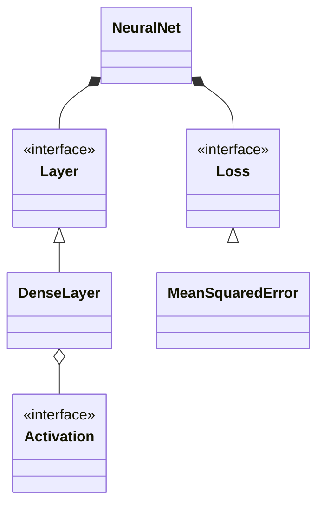

# Architecture

## Components

`NeuralNet` is the composition root and owns an ordered vector of `Layer` implementations plus one
`Loss`. `DenseLayer` owns flattened row-major weights, biases, and the last input/output cache.
Activations are immutable strategy objects shared across layers. `CSVLoader` is deliberately outside
the network so ingestion policy does not leak into numerical code.

## Invariants

- Layer dimensions are positive and adjacent output/input dimensions match.
- Inputs, targets, gradients, and learning rates are finite; vector sizes match declared shapes.
- `backward` requires a preceding `forward` on that layer.
- Input gradients are computed from the pre-update weights.
- Seeds are explicit and defaulted, never sourced from ambient global state.
- Objects own resources through standard containers and smart pointers.

## Concurrency

Prediction writes the forward cache, so a `NeuralNet` instance is not reentrant or thread-safe.
Independent instances can run concurrently. A production inference API should separate immutable
parameters from per-request activation workspaces before sharing a model across threads.
