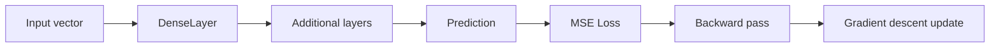

# Architecture

## Purpose

This repository demonstrates a small feedforward neural network implemented from scratch in C++17. The goal is educational clarity plus production-style engineering hygiene: deterministic builds, tests, memory checks, static analysis, packaging, and container smoke tests.

## Source Layout

```text
src/
  core/       Interface abstractions: Layer, Loss, Activation, NeuralNet
  impl/       Concrete implementations: DenseLayer, losses, activations
  main.cpp    Demo executable

tests/        GoogleTest suite
benchmarks/   Lightweight performance harness
.github/      CI, security, release, and repository automation
```

## Runtime Flow



## Design Principles

- Keep mathematical operations visible instead of hiding them behind ML frameworks.
- Prefer deterministic test seeds for reproducible CI behavior.
- Make build and runtime paths explicit.
- Treat CI as a product feature, not an afterthought.
- Add safety rails before adding advanced model features.

## Extension Points

- Add activation-aware layers.
- Add mini-batch gradient descent.
- Add Adam optimizer.
- Add serialization for trained weights.
- Add SIMD or CUDA acceleration.
- Add benchmark regression gates.
